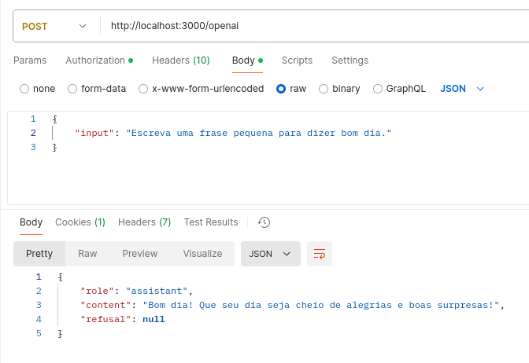

## Requisitos
Mudar o nome do ficheiro .env.example para .env e definir OPENAI_API_KEY

Instalar as dependencias com o seguinte comando
```bash
npm install
```

Rodar o servidor
```bash
node server.js
```

## Exemplo do request  
